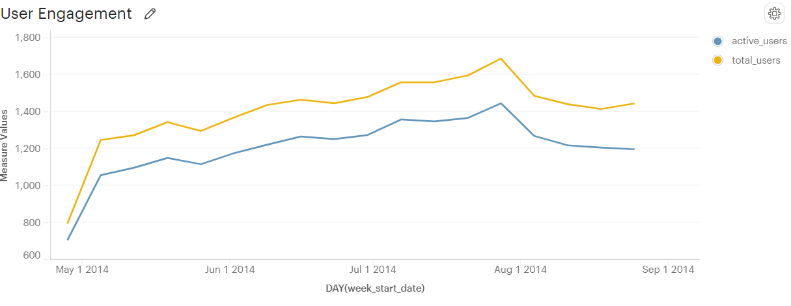
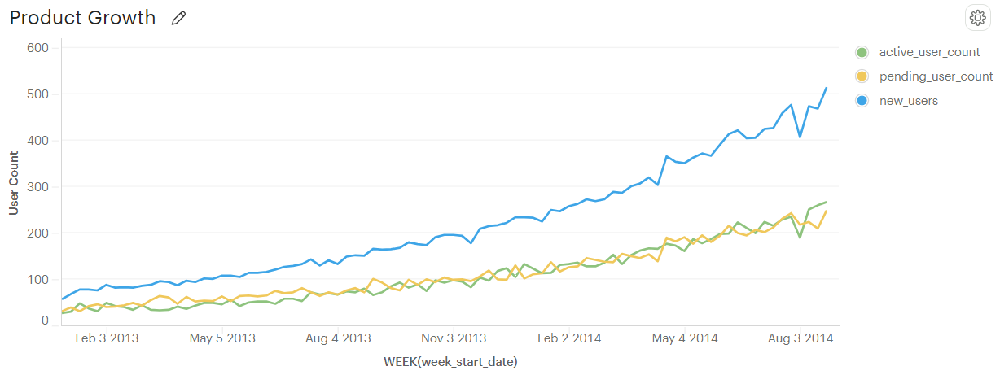
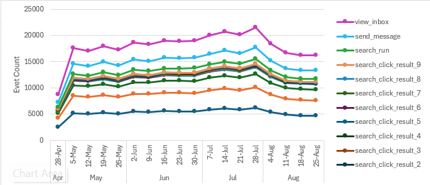
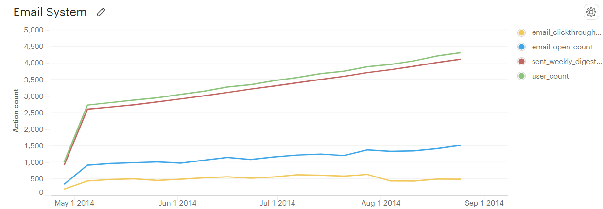
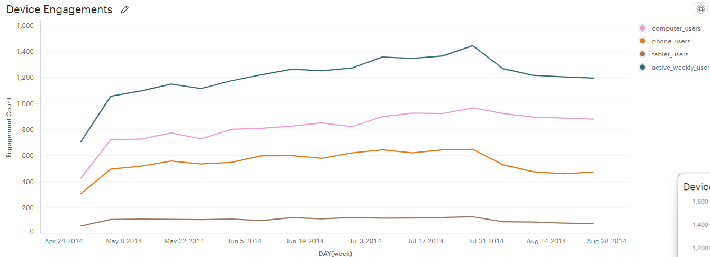

# Yammer Case Study

**Yammer** was founded in **2008** as a **freemium enterprise social networking service** designed for private communication within organizations. It was acquired by **Microsoft for $1.2 billion in 2012** and is now available in all **Office 365 products**.

## Table of Contents
- [Problem](#problem)
- [Key Metrics and Dimensions](#key-metrics-and-dimensions)
- [Summary and Insight](#summary-and-insight)
- [Identify Potential Problems](#identify-potential-problems)
- [Investigate Data](#investigate-data)
- [Identified Issues and Recommendations](#identified-issues-and-recommendations)
- [Appendix](#appendix)

## Problem
The head of the Product team approaches you with concerns about the latest activity on the user engagement dashboards. Upon reviewing the data, you notice a significant issue.

## Key Metrics and Dimensions
- **Engagement:** Any interaction by users within the server.
- **Period:** 28 April 2014 to 25 August 2014

## Summary and Insight


- **Problem:** What caused the dip at the end of the user engagement chart?

## 1. Initial Analysis: Insights from the Graph and Data

The graph shows the total number of weekly active users who logged in and engaged with various app features, such as commenting, sending emails, and searching. User engagement demonstrated a steady upward trend through mid-2014, but there was a notable drop at the end of July, reducing the engagement level to those seen in June. This lower engagement persisted through August.

While the graph does not directly explain the cause of the engagement decline, the accompanying data tables—which include information on demographics such as location, device usage, email interactions, and platform sign-ups—may provide valuable insights into the underlying reasons for this decrease.

## 2. Identify Potential Problems

- **Broken Feature:** There may be a malfunction within the application that is preventing users from utilizing certain features. Identifying such issues can be challenging, as different parts of the application might impact metrics in various ways. For instance, if a critical component of the signup process fails, it could lead to a reduction in new user registrations and overall growth. Similarly, if the mobile app experiences instability or crashes, it may only affect engagement on that specific device type.

- **Device Incompatibility:** The Yammer app or website might not function optimally on certain devices, which could prevent users from accessing various tools and features. This incompatibility could contribute to decreased user engagement and satisfaction.

- **Product Growth:** A potential decline in new user sign-ups could be contributing to lower engagement levels. If the sign-up process is experiencing issues or bugs, it might prevent new users from registering, thereby affecting overall engagement with the Yammer app.

- **Time of Year:** Engagement levels may be impacted by seasonal factors such as public holidays or vacations. These periods can lead to lower user activity due to reduced availability or engagement from users in different regions.

- **Location-Based Factors:** As a global application, Yammer may face competition from local alternatives in specific regions. Local competitors could potentially attract users away from Yammer, affecting its overall engagement and traction in those areas.

## 3. Investigate Data

### 3.1 Weekly Active Users


- **Investigate User Trends:** Conduct a detailed analysis of active user trends to understand their correlation with user engagement levels. Initial observations suggest that the number of active users aligns consistently with engagement counts. However, this correlation alone does not fully account for the decline in engagement. To gain a complete understanding, further investigation is necessary to identify any additional factors or underlying issues that may be contributing to this decline. This may involve examining specific user behaviors, feature usage patterns, and potential external influences affecting engagement.

### 3.2 Product Growth


- **Definitions:**
  - **Active User:** A user who has signed up, activated their profile, and is actively engaging with the product.
  - **Pending User:** A user who has signed up for an account but has not yet completed authentication or engaged with the product's content.
  - **New User:** A user who has recently created an account but may not yet be fully activated or engaged.

- **User Growth:** The user base for the product is expanding at a healthy rate, with no apparent issues in the sign-up process. There are no indications of a decline in the number of newly activated users. This suggests that the user acquisition process is functioning well and that new user activation rates remain stable.

### 3.3 Broken Feature


- **Explanation:** This plot illustrates the frequency of interactions with various features of the application. These interactions are aggregated to contribute to the overall engagement calculation. The primary objective of this plot is to determine if any features are malfunctioning, which could prevent users from accessing them and, consequently, reduce overall engagement.

- **Observation:** All features continue to receive interactions with a noticeable reduction in user engagement across the board. This indicates that there are no broken features, as each feature is still functional and being used. The observed decline in engagement is not attributed to any specific feature malfunctions.

### 3.4 Email


- **System:** The system appears to be functioning correctly, as it continues to send out weekly digest emails to users without any reported faults.

- **User:** The email open rate remains consistent, with a slight increase observed. However, there has been a noticeable drop in the click-through rate for links included in the weekly digest. This suggests that while users are still opening the emails, they are less frequently engaging with the links. This decline could be due to reduced interest in the content or potential issues with accessing the links, which might be contributing to the overall fall in engagement.

### 3.5 Device


- **Devices:** Analysis reveals that while overall weekly user engagement has decreased, engagement among computer users remains relatively stable. In contrast, there has been a significant decline in engagement among phone users. Both tablet and phone users have experienced a drop in engagement to below-average levels. This suggests a potential issue with the Yammer app on phone and tablet devices. Possible causes include problems with the app's ability to access or display links correctly, or recent updates to phone operating systems that may have introduced compatibility issues with the links. Further investigation is needed to determine the exact cause and address these issues to improve engagement across these devices.

## Identified Issues and Recommendations

- **Identified Issues:** All features appear to be functioning correctly, indicating that the source of the dip in weekly engagement is related to the reduction in click-through rates for emails. This issue is particularly evident among phone and tablet users, suggesting a potential software incompatibility with mobile systems.

- **Recommendation:** 
  1. **Investigate Recent Updates:** Examine whether there have been any recent updates to phone or tablet operating systems around the time of the engagement decline.
  2. **Check Email Accessibility:** Assess whether there are issues with accessing or interacting with email links on mobile devices.
  3. **Review Client-Side Feedback:** Review user feedback and client-side reports to identify any accessibility problems or usability issues related to email interactions on mobile devices.

## Appendix

### Tables

#### User Table


#### Email Table


#### Event Table


## SQL Code


### SQL Problem

```sql
SELECT DATE_TRUNC('week', e.occurred_at) AS week_date,
       COUNT(DISTINCT e.user_id) AS weekly_active_users
  FROM tutorial.yammer_events e
 WHERE e.event_type = 'engagement'
   AND e.event_name = 'login'
 GROUP BY 1
 ORDER BY 1;
```


### 3.1 Weekly Active Users

```sql
SELECT DATE_TRUNC('week', e.occurred_at) as week_date,
       COUNT(DISTINCT e.user_id) AS weekly_active_users
  FROM tutorial.yammer_events e
 WHERE e.event_type = 'engagement'
   AND e.event_name = 'login'
 GROUP BY 1
 ORDER BY 1;

```


### 3.2 Product Growth


```sql
SELECT DATE_TRUNC('week', e.occurred_at) AS week_start_date,
      COUNT(DISTINCT(CASE WHEN e.event_type = 'engagement' THEN user_id END)) AS active_users,
      COUNT(DISTINCT(CASE WHEN e.event_type = 'signup_flow' THEN user_id END)) AS signup_users,
      COUNT(DISTINCT user_id) AS total_users
FROM tutorial.yammer_events e
GROUP BY week_start_date
ORDER BY week_start_date;

```


### 3.3 Broken Feautures
*No SQL code available; refer to the [Excel data](features.xlsx) for detailed information.*


### 3.4 Email
```sql
SELECT 
    DATE_TRUNC('week', occurred_at) AS week_date,
    COUNT(DISTINCT(CASE WHEN action = 'sent_weekly_digest' THEN user_id ELSE NULL END)) AS sent_weekly_digest_count,
    COUNT(DISTINCT(CASE WHEN action = 'email_open' THEN user_id ELSE NULL END)) AS email_open_count,
    COUNT(DISTINCT(CASE WHEN action = 'email_clickthrough' THEN user_id ELSE NULL END)) AS email_clickthrough_count,
    COUNT(DISTINCT user_id) as user_count
FROM 
    tutorial.yammer_emails e
GROUP BY 
    DATE_TRUNC('week', occurred_at)
ORDER BY 
    week_date ASC;
```

### 3.5 Devices
```sql
SELECT 
    DATE_TRUNC('week', occurred_at) AS week,
    COUNT(DISTINCT user_id) AS active_weekly_user,
    COUNT(DISTINCT CASE WHEN device IN ('iphone 5', 'samsung galaxy s4', 'nexus 5', 'iphone 5s', 'iphone 4s', 
                                       'nexus 7', 'nokia lumia 635', 'nexus 10', 'htc one', 'amazon fire phone', 
                                       'samsung galaxy note') 
                        THEN user_id 
                        ELSE NULL END) AS phone_users,
    COUNT(DISTINCT CASE WHEN device IN ('ipad air', 'ipad mini', 'kindle fire', 'samsung galaxy tablet') 
                        THEN user_id 
                        ELSE NULL END) AS tablet_users,
    COUNT(DISTINCT CASE WHEN device IN ('lenovo thinkpad', 'macbook pro', 'macbook air', 'dell inspiron desktop',
                                       'dell inspiron notebook', 'asus chromebook', 'acer aspire notebook', 
                                       'hp pavilion desktop', 'acer aspire desktop', 'windows surface', 
                                       'mac mini') 
                        THEN user_id 
                        ELSE NULL END) AS computer_users
FROM 
    tutorial.yammer_events
WHERE 
    event_type = 'engagement'
    AND event_name = 'login'
GROUP BY 
    DATE_TRUNC('week', occurred_at)
ORDER BY 
    week;
```
