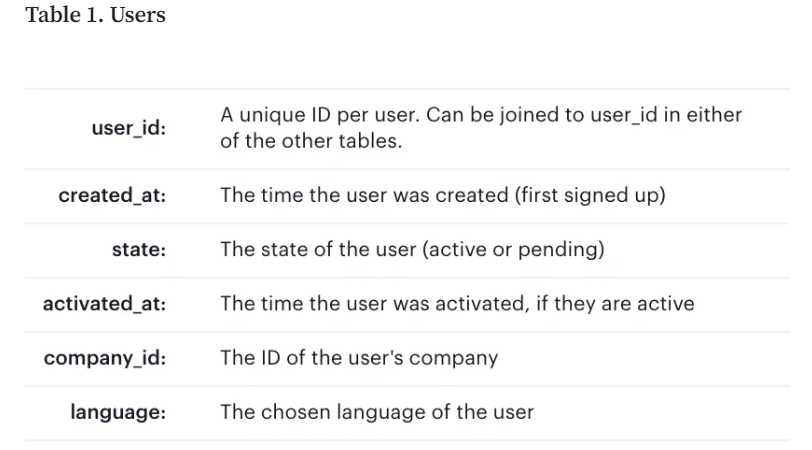
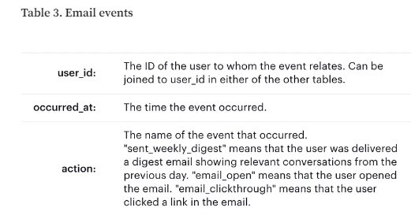

# Yammer Case Study

**Yammer** was founded in **2008** as a **freemium enterprise social networking service** used for private communication within organizations. It was acquired by **Microsoft for $1.2 billion in 2012** and is now available in all **Office 365 products**.

## Table of Contents
- [Problem](#problem)
- [Key Metrics and Dimensions](#key-metrics-and-dimensions)
- [Tables](#tables)
- [Summary and Insight](#summary-and-insight)

## Problem
The head of the Product team walks over to your desk and asks you what you think about the latest activity on the user engagement dashboards. You fire them up, and **something immediately jumps out**.

## Key Metrics and Dimensions
- **Engagement:** Any interaction done by users in the server
- **Period:** 28 April 2014 to 25 August 2014

## Summary and Insight


- **Problem:** What caused the dip at the end of the user engagement chart?

```sql
SELECT DATE_TRUNC('week', e.occurred_at) AS week_date,
       COUNT(DISTINCT e.user_id) AS weekly_active_users
  FROM tutorial.yammer_events e
 WHERE e.event_type = 'engagement'
   AND e.event_name = 'login'
 GROUP BY 1
 ORDER BY 1;
```

## 1. Initial Analysis: What can we understand from the graph and data

The graph depicts the aggregate number of weekly active users who logged in and interacted with various app features, such as commenting, sending emails, and searching, as detailed in the event table. User engagement demonstrated a consistent upward trend through mid-2014. However, a significant drop occurred at the end of July, with a reduction of approximately 200 users, reverting engagement levels to those observed in June. This lower level of engagement persisted through August.

Although the graph does not explicitly explain the cause of the engagement decline, the accompanying data tables—which include information on demographics such as location, device usage, email interactions, and platform sign-ups—may offer valuable insights into the underlying reasons for this decrease.


## 2. Identify Potential Problems

- **Broken Feature:** There may be a malfunction within the application that is preventing users from utilizing certain features. Identifying such issues can be challenging, as different parts of the application might impact metrics in various ways. For instance, if a critical component of the signup process fails, it could lead to a reduction in new user registrations and overall growth. Similarly, if the mobile app experiences instability or crashes, it may only affect engagement on that specific device type.

- **Device Incompatibility:** The Yammer app or website might not function optimally on certain devices, which could prevent users from accessing various tools and features. This incompatibility could contribute to decreased user engagement and satisfaction.

- **Declined Growth:** A potential decline in new user sign-ups could be contributing to lower engagement levels. If the sign-up process is experiencing issues or bugs, it might prevent new users from registering, thereby affecting overall engagement with the Yammer app.

- **Time of Year:** Engagement levels may be impacted by seasonal factors such as public holidays or vacations. These periods can lead to lower user activity due to reduced availability or engagement from users in different regions.

- **Location-Based Factors:** As a global application, Yammer may face competition from local alternatives in specific regions. Local competitors could potentially attract users away from Yammer, affecting its overall engagement and traction in those areas.


## 3. Investigate Data

### 3.1 Weekly Active Users


- Investigae the trend of active users to understand the correlation with user engagement


## Tables

### User Table


### Email Table


### Event Table


