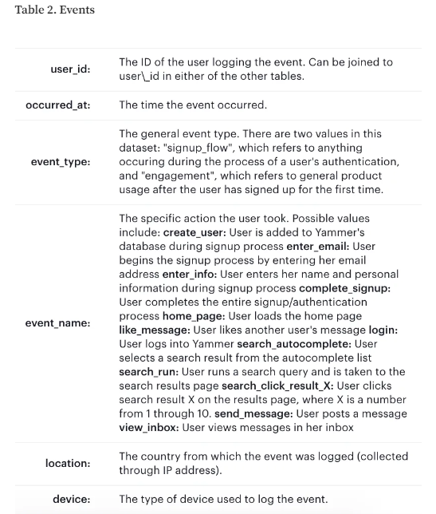
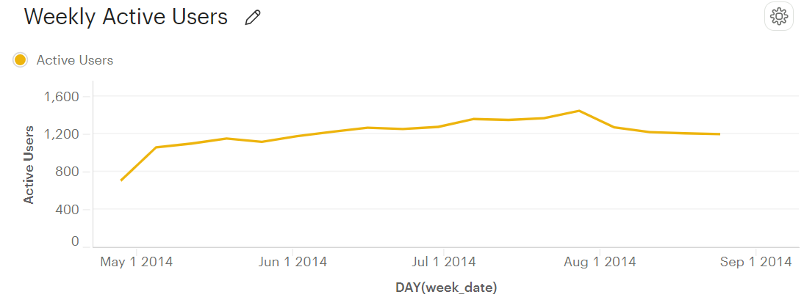

# Yammer Case Study

**Yammer** was founded in **2008** as a **freemium enterprise social networking service** used for private communication within organizations. It was acquired by **Microsoft for $1.2 billion in 2012** and is now available in all **Office 365 products**.

## Table of Contents
- [Problem](#problem)
- [Key Metrics and Dimensions](#key-metrics-and-dimensions)
- [Summary and Insight](#summary-and-insight)

## Problem
The head of the Product team walks over to your desk and asks you what you think about the latest activity on the user engagement dashboards. You fire them up, and **something immediately jumps out**.

## Key Metrics and Dimensions
- **Engagement:** Any interaction done by users in the server
- **Period:** 28 April 2014 to 25 August 2014





## Summary and Insight


- **Problem:** What caused the dip at the end of the user engagement chart?

```sql
SELECT DATE_TRUNC('week', e.occurred_at) as week_date,
       COUNT(DISTINCT e.user_id) AS weekly_active_users
  FROM tutorial.yammer_events e
 WHERE e.event_type = 'engagement'
   AND e.event_name = 'login'
 GROUP BY 1
 ORDER BY 1;
